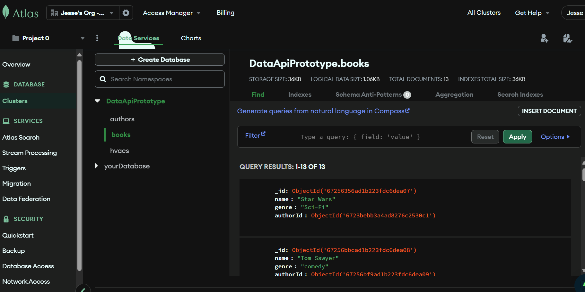

# graphQL POC
Recommend this playlist to learn more about GraphQL + react + mongoDb + mongoose by Net Ninja an excellent teacher
https://www.youtube.com/playlist?list=PL4cUxeGkcC9iK6Qhn-QLcXCXPQUov1U7f

Node modules are not included in the course files. After download, run npm install to install the modules (client and server folders)

This is an updated FORK by Jesse Boyd of the original code by Net Ninja with modern react functional components, mongoDb Atlas and tanstack useQuery

## Backend: 
Create a free account at https://www.mongodb.com/atlas 

1.	Create a free account
2.	Create a MongoDB NoSQL cloud instance.
3.	Create a free cluster and use Amazon services
4.	Note the autogenerated username and password ->-> click ‘create database user’ with this autogenerated user to get started
5.	Note: current IP address will be allowed on setup for local connectivity
    a. you can allow all ips by clicking on the ip warning from your admin screen and allowing all ips there or just your new ip address

    

####    Connecting to your unique data
* create models of your data shapes
* update schema.js with new queries of those models


## Server:
to start => Inside server folder terminal : "nodemon  --env-file=.env express-server.js"

you may need to install nodemon globally

verify in the terminal "connected to database" 

if error you may need to verify your uri in express-server.js to match your atlas db

* server includes GraphiQL at http://localhost:4000/graphql which is a helpful gui to test your queries and display available root types (models for query)
* you will need to populate the db with at least one author, book and hvac with exactly the same types as your models

basic hvac query specifying index, use the RootQueryType link in document explorer or tab to see all options
```
{
  hvac(hvacIndex: 1001) {
    isHealthy
    airTemp
    arrays
  }
}
```
example authors query for graphiQL
```
{
  authors {
    id
    name
    age
    books {
      id
      name
      genre
  
    }
  }
}
```

## Front-End React Demo - Books and Authors query and mutations
to start => inside modernClient folder terminal : "yarn dev" or "npm run dev"

* note schema.js type must match EXACTLY what you set up in your mongoDb Atlas, if your queries are not working this is most likely the issue
* schema.js is where you can see relations set up for example the field book under author type.  note the use of GraphQLID which is an important type and not just a number
* note models like book.js and author.js which defines model shape and is used for queries
* addBook.jsx is an example of a mutation which updates the database
* tanstack useQuery was chosen (previous experience with) but one can also use Apollo Client for making graphQL requests
*    see: https://graphql.org/community/tools-and-libraries/?tags=javascript for the many options, there are options for java and other languages as well.


